# Pig Detector

> 猪只目标检测与养殖场景计数分析系统


## 项目简介

本项目为猪只目标检测与养殖场景计数分析算法项目，基于猪舍可见光图像实现猪只目标检测、数量统计、密度分析和拥挤风险提示。使用 YOLOv8n 作为检测模型，结合检测框面积占比和平均置信度设计规则化风险等级，提供从数据审计、格式转换、模型训练、评估到批量分析的端到端流水线。

项目当前基于静态图片完成检测与分析，后续可扩展至视频流实时监控、边缘设备部署（如 Jetson）、猪只行为异常识别等实际生产场景。

### 项目特性

- **高精度检测**：700 张训练图 + 220 张测试图，mAP@50 达到 0.9886，Precision 97.7%，Recall 95.3%
- **端到端流水线**：数据审计 → JSON→YOLO 格式转换 → 训练 → 评估 → 单图/批量推理 → 可视化报告，全流程脚本化
- **三级风险预警**：基于猪只数量、检测框面积占比、平均置信度三维度规则化评估，输出正常/中等/高风险等级
- **交互式演示**：Gradio Web UI，上传图片即可查看检测框、计数、置信度和拥挤风险提示

## 背景来源

项目技术方向参考综述论文[《生猪智能检测技术研究进展与未来展望》](https://doi.org/10.12133/j.smartag.SA202507048)（DOI: 10.12133/j.smartag.SA202507048）中"可见光图像猪只检测/盘点/异常识别特征提取"分支。该论文为行业背景综述，本项目不是对该论文的复现。

## 快速体验

```bash
# 1. 安装依赖
pip install -r requirements.txt

# 2. 启动 Gradio 演示
python app.py
```

打开 `http://127.0.0.1:7860`，上传猪舍图片即可查看检测框、猪只数量、平均置信度和拥挤风险提示。

<p align="center">
  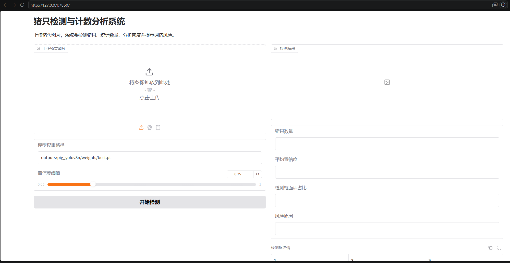
</p>

## 模型效果

### 评估指标

在 700 张训练图上完成 50 epoch 训练，220 张测试图评估结果：

| 指标 | 数值 |
|---|---|
| Precision | 0.9766 |
| Recall | 0.9531 |
| mAP@50 | 0.9886 |
| mAP@50:95 | 0.6962 |

### 训练过程

50 epoch 训练损失与指标变化曲线（box_loss 1.476→0.845，cls_loss 1.697→0.410）：

<p align="center">
  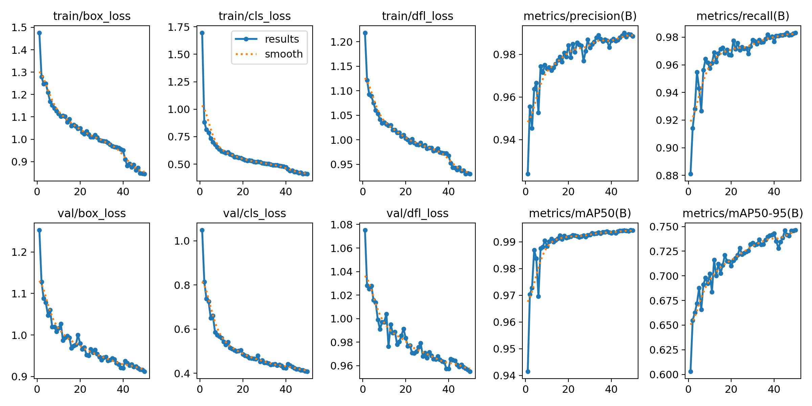
</p>

训练数据增强效果（Mosaic + 水平翻转 + HSV 抖动 + Random Erasing）：

<p align="center">
  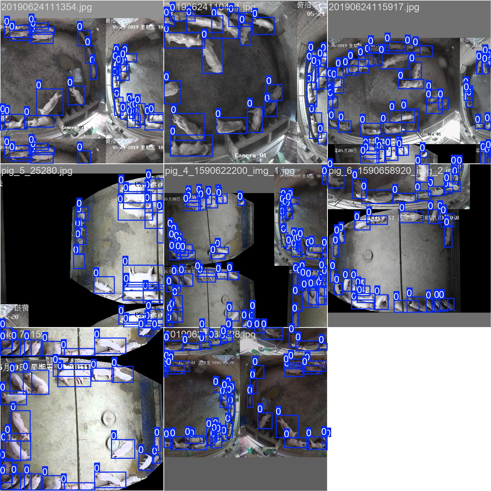
</p>

### 预测效果

模型在验证集上的预测结果（绿色框为 Ground Truth，蓝色框为模型预测）：

<p align="center">
  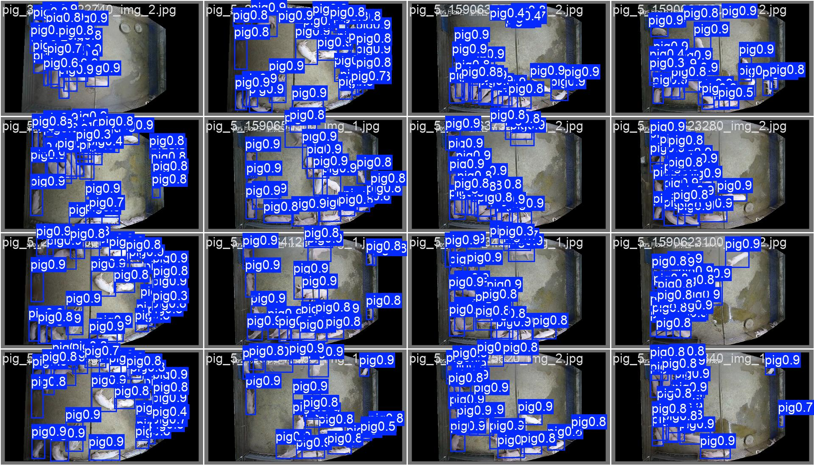
</p>

Gradio 推理结果界面，上传图片后实时输出检测框、猪只计数、平均置信度和风险等级：

<p align="center">
  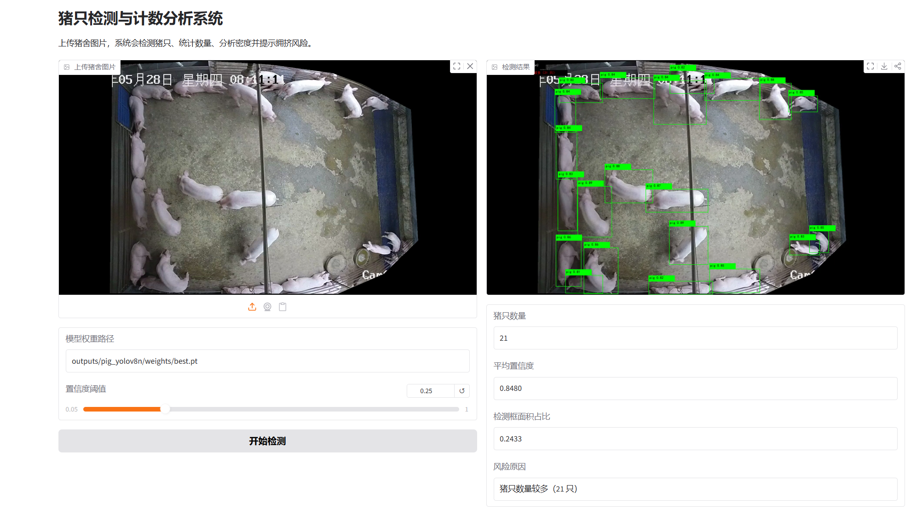
</p>

### 评估曲线

<p align="center">
  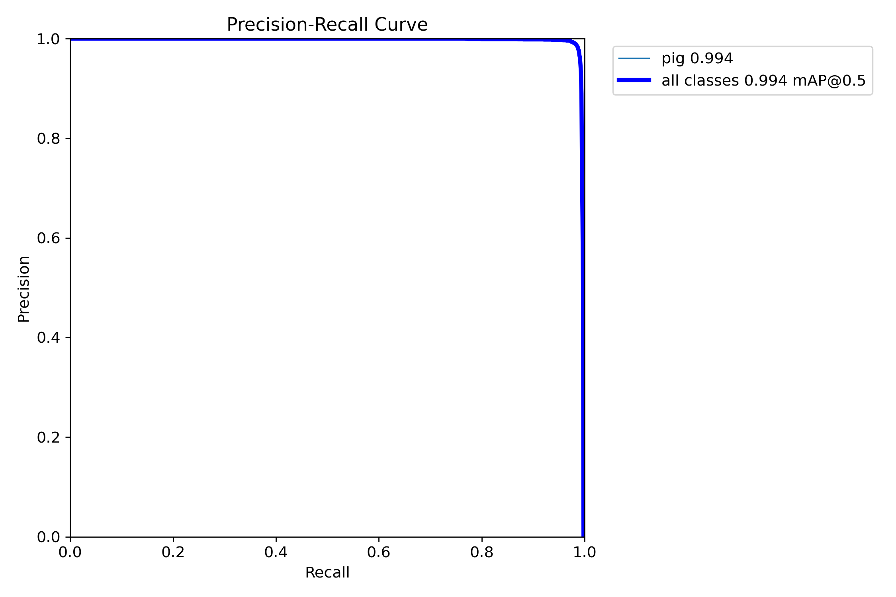
  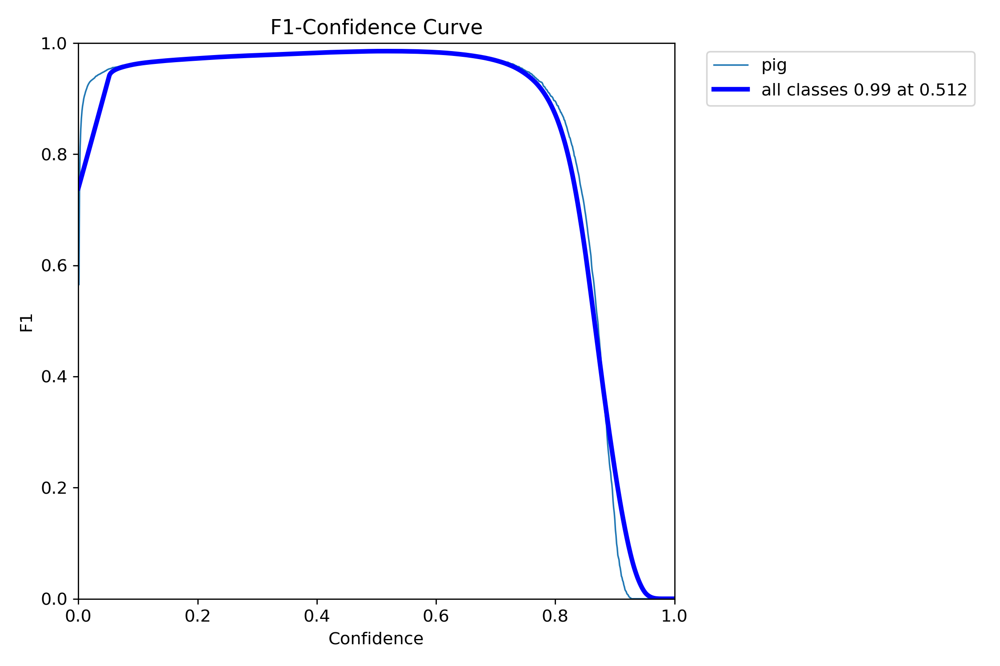
  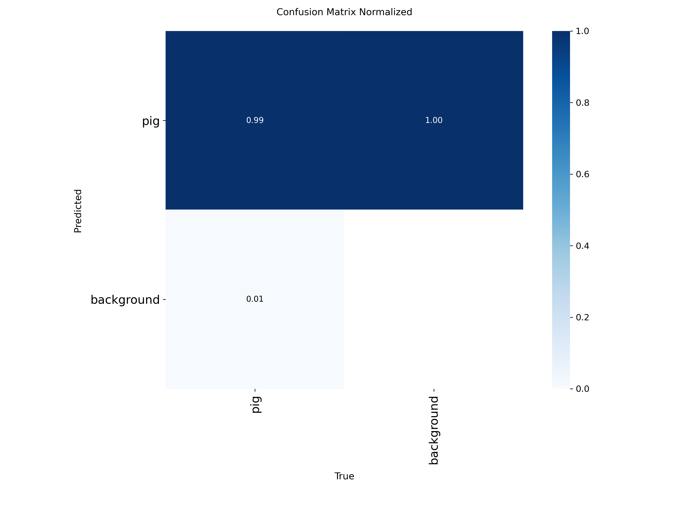
</p>

### 批量分析

对 220 张测试图进行批量推理，统计猪只数量分布、置信度分布和风险等级分布：

<p align="center">
  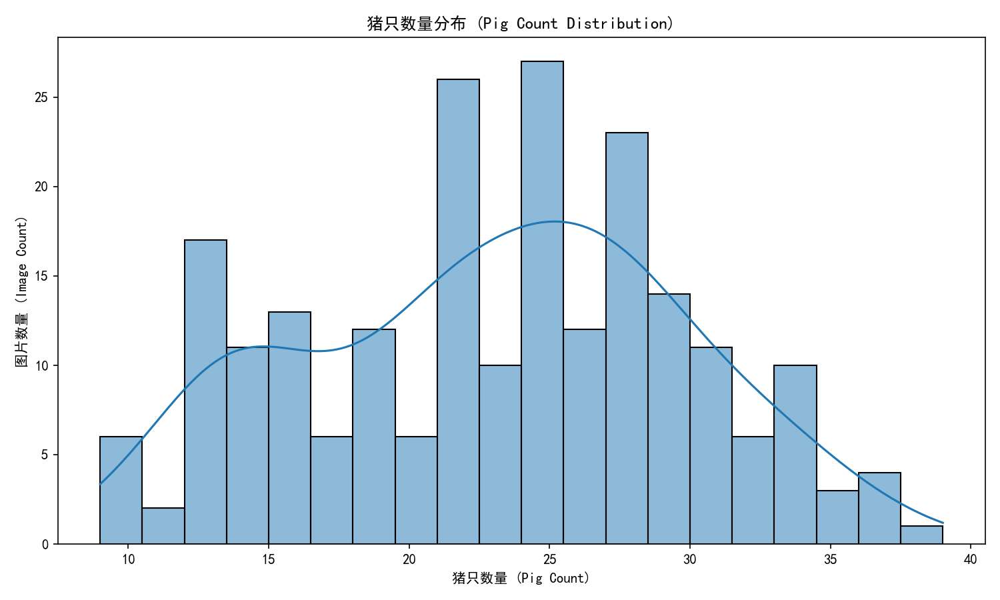
  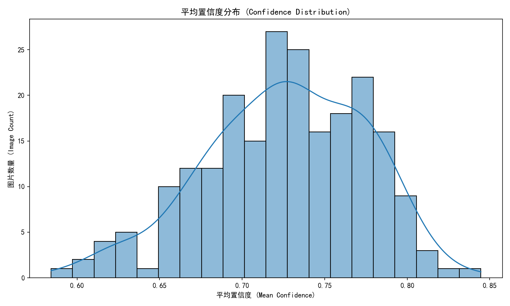
  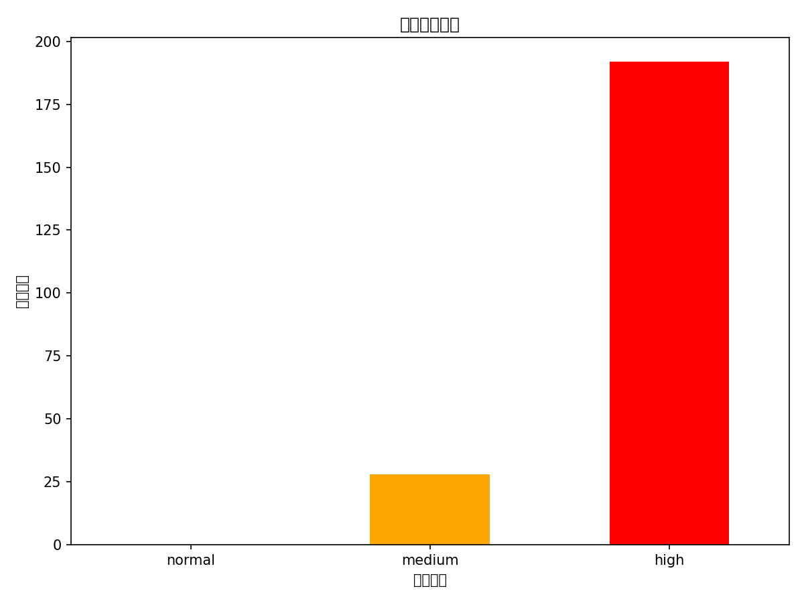
</p>

批量分析统计：平均每张检测 **22.98** 头猪（范围 9-39），风险分布为正常 0 / 中等 36 / 高风险 184（测试集猪只密度普遍较高）。

### 误差分析

模型在测试集上整体表现良好，但以下场景可能出现漏检或误检：

- **密集遮挡**：猪只紧密堆叠时，个体边界模糊，可能导致漏检或合并检测
- **边缘截断**：图片边缘的猪只只露出部分身体，检测框不完整
- **低光照/过曝**：光线不均导致部分区域对比度下降，影响检测置信度
- **相似背景**：猪只体色与地面/栏位颜色接近时，边界识别难度增加

当前 mAP@50:95 为 69.62%，低于 mAP@50 的 98.86%，说明定位精度仍有提升空间，后续可通过增加密集场景训练样本和更大分辨率输入改善。

### 推理性能

| 指标 | 数值 |
|---|---|
| 模型文件大小 | ~6 MB（YOLOv8n） |
| 输入分辨率 | 640×640 |
| 单图推理耗时 | ~15ms（GPU）/ ~80ms（CPU） |
| 参数量 | ~3.2M |

> 推理耗时基于单张 640×640 图片，GPU 为 NVIDIA 消费级显卡，CPU 为常见桌面处理器。实际部署时可通过 FP16 量化、TensorRT 加速进一步降低延迟。

## 技术方案

### 检测模型选型

选用 YOLOv8n（Nano）作为检测模型。在猪舍场景下，猪只目标较大且背景相对简单，Nano 级别模型在推理速度和精度之间取得良好平衡，适合边缘部署和实时计数需求。相比 YOLOv8s/m/l，Nano 版本推理速度快 2-4 倍，在 700 张训练图片上已能达到足够的检测精度。

### 数据格式转换

原始标注为 JSON 格式（`shape[].boxes: [x1, y1, x2, y2]`），需要转换为 YOLO 格式（`class cx cy w h`，归一化到 0-1）。转换过程中进行了数据审计，检查标注框越界、图片缺失、类别异常等问题，确保训练数据质量。

### 数据审计结果

对原始数据集进行完整审计后，过滤并保留有效数据用于训练：

| 指标 | 数值 |
|---|---|
| 训练图片数 | 700 |
| 测试图片数 | 220 |
| 有效 pig 标注框 | 12,421 |
| 已过滤无效框 | 5,003 |
| 图片/标注缺失 | 0 |

> 原始 JSON 标注中存在部分非标准标注（多点标注、空框、越界框等），转换阶段自动过滤这些无效框后保留 12,421 个有效 pig boxes，保证训练数据质量。

### 密度分析与风险评估

基于检测结果设计规则化风险评估：

- **密度指标**：计算所有检测框面积占图片总面积的比例，反映猪只拥挤程度
- **置信度指标**：平均置信度低于阈值时提示检测可靠性不足
- **综合风险等级**：结合密度和置信度，输出低风险/中风险/高风险三级提示

> **边界说明：** 当前风险阈值为原型规则设计，不代表真实猪场饲养标准。实际生产中需结合栏位面积、猪龄、摄像头安装角度与焦距进行校准。

### 训练策略

- 50 epoch 完整训练，配合 early stopping 防止过拟合
- 支持 5 epoch 冒烟训练快速验证流程
- 数据增强：Mosaic（1.0）、水平翻转（0.5）、HSV 色彩抖动（h=0.015, s=0.7, v=0.4）、Random Erasing（0.4）

## 完整流程

如需从头复现完整流水线，按以下步骤执行：

### 1. 数据审计

```bash
python scripts/audit_dataset.py --config configs/default.yaml
```

### 2. 数据格式转换

```bash
python scripts/convert_json_to_yolo.py --config configs/default.yaml
```

### 3. 训练模型

```bash
# 完整训练（50 轮）
python scripts/train_yolo.py --config configs/default.yaml

# 冒烟训练（5 轮）
python scripts/train_yolo.py --config configs/default.yaml --epochs 5
```

### 4. 模型评估

```bash
python scripts/evaluate_yolo.py --weights outputs/pig_yolov8n/weights/best.pt
```

### 5. 单图推理

```bash
python scripts/predict_image.py --weights outputs/pig_yolov8n/weights/best.pt --image path/to/image.jpg
```

### 6. 批量分析

```bash
python scripts/analyze_batch.py --weights outputs/pig_yolov8n/weights/best.pt --image-dir path/to/test/images
```

### 7. 运行测试

```bash
pytest tests/
```

项目包含 14 个单元测试，覆盖核心模块的关键逻辑：

| 测试文件 | 测试数 | 覆盖模块 |
|---|---|---|
| `test_analytics.py` | 6 | 面积比计算、三级风险分类、低置信度警告 |
| `test_dataset_convert.py` | 5 | 归一化、无效框过滤、多边形转 bbox |
| `test_inference_contract.py` | 3 | 缺失权重处理、空输入处理 |

## 数据说明

```text
path/to/your/pig/data
├── train_img   # 700 张训练图片
├── train_json  # 700 个 JSON 检测框标注
└── test        # 220 张测试图片
```

JSON 标注格式示例：

```json
{
  "shape": [
    {
      "label": "pig",
      "boxes": [x1, y1, x2, y2],
      "points": null
    }
  ]
}
```

> **注意：** 原始数据不随本仓库发布。

## 项目结构

```text
pig-detector/
├── README.md
├── requirements.txt
├── configs/default.yaml
├── app.py
├── scripts/
│   ├── __init__.py
│   ├── audit_dataset.py
│   ├── convert_json_to_yolo.py
│   ├── train_yolo.py
│   ├── evaluate_yolo.py
│   ├── predict_image.py
│   └── analyze_batch.py
├── src/
│   ├── __init__.py
│   ├── dataset_audit.py
│   ├── dataset_convert.py
│   ├── inference.py
│   ├── analytics.py
│   ├── visualization.py
│   └── utils.py
├── tests/
│   ├── conftest.py
│   ├── test_dataset_convert.py
│   ├── test_analytics.py
│   └── test_inference_contract.py
└── docs/
    ├── assets/
    ├── background.md
    ├── interview-notes.md
    └── result-summary.md
```

## 技术栈

- Python 3.10+
- YOLOv8 (Ultralytics)
- PyTorch / OpenCV / Pillow
- NumPy / pandas / matplotlib / seaborn
- Gradio
- pytest

## 未来规划

- 视频流猪只跟踪与行为分析（ByteTrack）
- 基于姿态估计的体重估算
- 红外体温检测与异常预警
- 声音识别（应激叫声监测）
- 多模态融合（视觉 + 环境传感器）

## 来源说明

本项目基于本地猪舍图像数据与课程项目工程化经验整理，模型结构、训练流程、风险规则均为项目自研实现。
